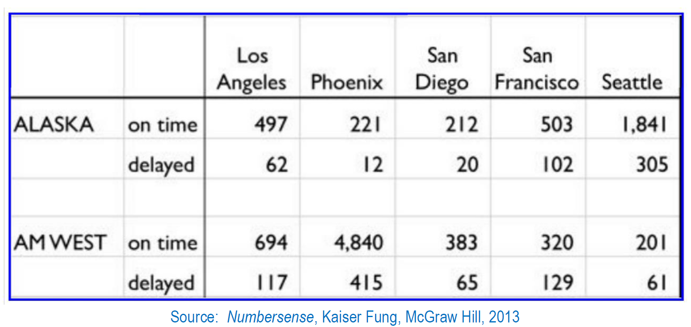

# Introduction/Approach

The objective of this Week 5 Airplane Delays assignment is to reconstruct the flight arrival/delay dataset shown in the prompt (two airlines spanning five destinations) and then use R to tidy, transform, and analyse the data. The analysis will focus on percentages (not just the raw counts of on-time and delayed flights), comparing the two airlines' performances both overall and city-by-city, and then explaining why those two comparisons may lead to different conclusion. The discrepancy may reflect Simpson's Paradox, where aggregated results differ from subgroup results due to differences in weighting across the subgroups themselves.

## Data Structure

The data will be constructed initially in a wide format, to mirror how the information appears within the presented prompt, then transformed into a long/tidy format for analysis.

Specifically, the constructed wide formatting will reflect the image below:

In this, we can observe that the column headings feature the destinations, whilst the row headings contain the airline names and the 'on time'/'delayed' status labels.

After transformation into long format, each row will instead reflect a singular observation, with the following columns: airline \| status \| city \| count.

## Proposed Plan

The analytical approach will likely follow the steps outlined below:

-   Construct and publish the the wide CSV (from Excel to GitHub)

    -   The dataset will be recreated in Excel using the wide structure in the prior presented image.

    -   In this, any layout styled blanks will be preserved (such as the blank row between the two airline data rows).

    -   Export the Excel file as a CSV.

    -   Upload said CSV to my public GitHub repository so it can be read directly into RStudio.

-   Import in R and clean the wide file

    -   Once the CSV file has been read into R, the blank separator row between the two airlines must be removed.

    -   The counts of flights for each city must be converted to numeric.

-   Transform from wide to long, with the use of the pivot_longer() functionality. In this, the columns of city and count will be created, while retaining airline and status.

-   Compare the airlines' overall percentages. For each airline, we will calculate total flights and delayed flights to determine the overall delay relate (the total delayed flights/the total number of flights).

-   Compare the airlines' city-by-city performance. In this, the delay rate for each airline will be calculated at the city level.

-   Explain any discrepancies observed between the overall versus the city-by-city results.

## Anticipated Challenges

One expected challenge involves data cleaning that will be required on import. The blank separator row may be read in as an NA record and should thus be removed, and the count values may import as character strings (due to the comma formatting), requiring conversion before analysis.

Additionally, the analytical write up must clearly explain any mismatch between overall and city-level performance as a weighting effect (and potentially an example of Simpson's paradox) rather than as a contradiction or error within the data itself.

## Optional Endeavors

-   Provide a table/chart for both the overall delay rate comparison and the city-by-city delay rate comparison.

-   Include at least one hand-calculated validation (for both the overall and city-by-city delay rate calculations), to ensure that it matches the outputted R calculations.
